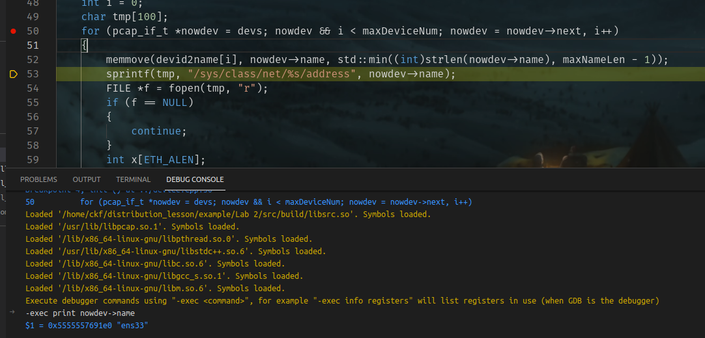
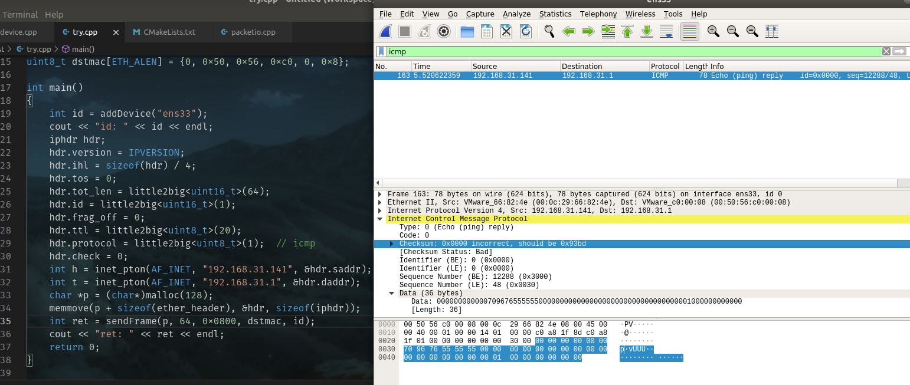
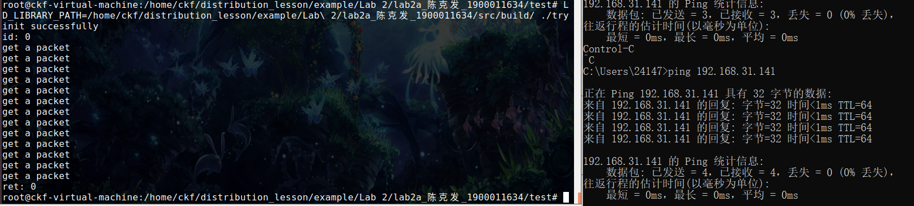

# lab2a report

## code layout

```bash
$tree
├── src      # source code to implement the linker function 
│   ├── CMakeLists.txt
│   ├── device.cpp
│   ├── device.hpp
│   ├── general.hpp
│   ├── packetio.cpp
│   └── packetio.hpp
└── test    # test program
    ├── try.cpp
```

using the following command to compile code in src directory.

```bash
$mkdir build
$cd build
$cmake ..
$make
```

And we can finally get a libsrc.so in build directory.

Use the following command to compile and run "try program"

```bash
$g++ -o try try.cpp -L../src/build -lsrc -lpcap -lpthread
$./try    # need root privilege and set LD_LIBRARY_PATH to find libsrc.so
```

because different ip address and mac address in different host,  may need to change the following global value in try.cpp to reproduce the results displayed in checkpoints.

```c
uint8_t dstmac[ETH_ALEN] = {0, 0x50, 0x56, 0xc0, 0, 0x8};   // mac address of destination
const char saddr[] = "192.168.31.141";              // ip address of linux virtual machine 
const char daddr[] = "192.168.31.1";                // ip address of destination (windows host)
const char deviceName[] = "ens33";                  // device name to send packets
```


## checkpoint1

Here is a debug screenshot. I use gdb command "print nowdev->name" to print device's name(device list comes from pcap_findalldevs function). We can see the device named "ens33" has been printed out in the bottom. Of course, by iterating "nowdev->address", we can see the ip address of device.  



## checkpoint2

The following picture shows my implementation can inject packet to the network. in test/try.cpp, I inject a icmp packet sent to windows host and set checksum of ip equal to 0 in try.cpp. We can see a icmp packet with ip checksum equal to 0 by wireshark.



In try.cpp the program sleeps 20 seconds to wait packets. Meanwhile, I use ping program in windows host to generate packets. And the following pictures shows my implementation can receive packets from a device. 



```c
void receiveFrame(uint8_t* handle, const pcap_pkthdr* pkthdr, const uint8_t* data){   // callback function in src/packetio.cpp
    printf("get a packet\n");   
    /*if(signal == 1){
        pcap_breakloop((pcap_t*)handle);
    }*/
}
```

